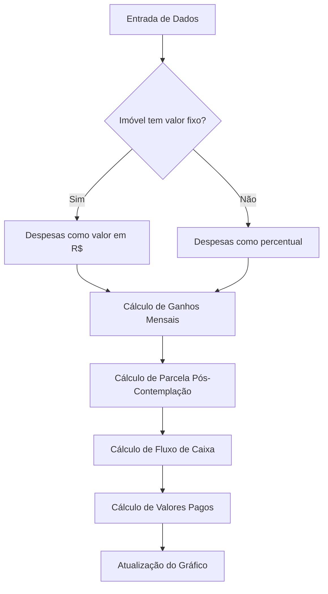
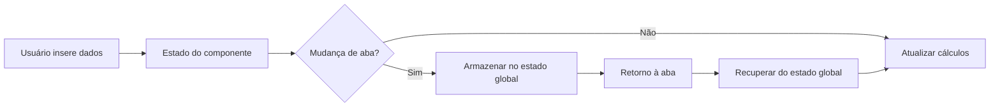
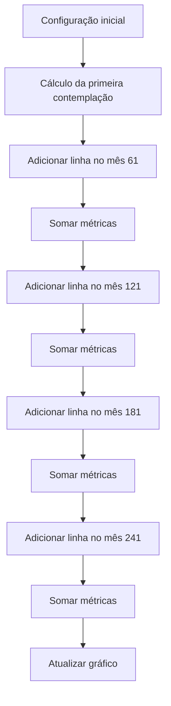

# Design Document

## Visão Geral

Este documento descreve o design técnico para implementar as melhorias no simulador da plataforma Monteo. As melhorias incluem correções na exibição de valores, implementação de persistência de dados entre navegações, correção dos cálculos de alavancagem patrimonial e implementação correta da alavancagem escalonada.

## Arquitetura

A plataforma Monteo é construída utilizando React com TypeScript, e utiliza componentes da biblioteca Shadcn UI. As melhorias serão implementadas mantendo a arquitetura atual, com foco em:

1. Correção de lógica de exibição de valores
2. Implementação de estado persistente entre navegações
3. Correção de fórmulas de cálculo
4. Melhoria na visualização de dados

## Componentes e Interfaces

### 1. Componentes Afetados

#### 1.1 Exibição de Valores
- `FunnelModal.tsx`: Componente que exibe o modal de configuração de funis
- `LeveragesList.tsx`: Componente que lista as alavancas na página de configurações
- `CreditAccessPanel.tsx`: Componente que exibe a taxa anual na aba Crédito acessado

#### 1.2 Persistência de Dados
- `PatrimonialLeverage.tsx`: Componente da aba de alavancagem patrimonial
- `SimulatorTabs.tsx`: Componente que gerencia as abas do simulador
- `PropertyCharacteristics.tsx`: Componente que exibe as características do imóvel
- `SimulationDataPanel.tsx`: Componente que exibe os dados da simulação

#### 1.3 Cálculos de Alavancagem
- `useAdvancedCalculations.ts`: Hook que contém os cálculos avançados
- `advancedCalculations.ts`: Utilitário com funções de cálculo
- `PatrimonialLeverage.tsx`: Componente que exibe os resultados dos cálculos
- `PatrimonialLeverageNew.tsx`: Componente atualizado para alavancagem patrimonial

#### 1.4 Alavancagem Escalonada
- `ScaledLeverage.tsx`: Componente que implementa a alavancagem escalonada
- `PatrimonyChart.tsx`: Componente que exibe o gráfico de evolução patrimonial

### 2. Interfaces de Dados

```typescript
// Interface para os dados de alavancagem patrimonial
interface PatrimonialLeverageData {
  propertyValue: number;
  hasFixedValue: boolean;
  dailyPercentage: number;
  adminPercentage: number;
  occupancyRate: number;
  expensesValue: number | string; // Pode ser valor ou percentual
  contemplationExample: {
    frequency: number;
    type: 'simple' | 'scaled';
    withEmbedded: boolean;
  };
}

// Interface para os resultados dos cálculos
interface CalculationResults {
  patrimonyAtContemplation: number;
  finalPatrimony: number;
  monthlyGains: number;
  postContemplationInstallment: number;
  cashFlowBefore240: number;
  cashFlowAfter240: number;
  paidFromOwnPocket: {
    value: number;
    percentage: number;
  };
  paidByTenant: {
    value: number;
    percentage: number;
  };
}

// Interface para os dados do gráfico de evolução patrimonial
interface PatrimonyChartData {
  month: number;
  patrimony: number;
  income: number;
  cashFlow: number;
}

// Interface para os dados de simulação
interface SimulationData {
  mode: 'aporte' | 'credito';
  value: number;
  installments: number;
  installmentType: string;
}
```

## Modelo de Dados

Não serão necessárias alterações no modelo de dados do banco de dados para as melhorias propostas. As alterações serão principalmente na lógica de cálculo e na persistência de dados no estado da aplicação.

## Estratégias de Implementação

### 1. Correção da Exibição de Valores

#### 1.1 Exibição de Despesas
Implementaremos uma lógica condicional no componente `LeveragesList.tsx` para exibir o valor das despesas como valor em reais ou percentual, dependendo do valor do campo "Imóvel tem valor fixo":

```typescript
const formatExpenses = (leverage) => {
  if (leverage.hasFixedValue) {
    return formatCurrency(leverage.expensesValue);
  } else {
    return `${leverage.expensesValue}%`;
  }
};
```

#### 1.2 Formatação da Taxa Anual
Modificaremos a função de formatação de percentuais no componente `CreditAccessPanel.tsx` para garantir que a taxa anual seja exibida com no máximo duas casas decimais:

```typescript
const formatPercentage = (value) => {
  return `${parseFloat(value).toFixed(2)}%`;
};
```

### 2. Persistência de Dados entre Navegações

#### 2.1 Armazenamento Local
Utilizaremos o localStorage para armazenar os dados inseridos nos campos "Características do Imóvel" e "Exemplo de contemplação":

```typescript
// Salvar dados
const savePropertyData = (data) => {
  localStorage.setItem('propertyCharacteristics', JSON.stringify(data));
};

// Recuperar dados
const loadPropertyData = () => {
  const savedData = localStorage.getItem('propertyCharacteristics');
  return savedData ? JSON.parse(savedData) : null;
};
```

#### 2.2 Estado Global
Criaremos um estado global utilizando o Context API do React para compartilhar os dados entre os componentes:

```typescript
const SimulatorContext = React.createContext();

export const SimulatorProvider = ({ children }) => {
  const [simulationData, setSimulationData] = useState({
    mode: 'aporte',
    value: 0,
    installments: 240,
    installmentType: '',
  });
  
  const [propertyData, setPropertyData] = useState({
    propertyValue: 0,
    hasFixedValue: false,
    dailyPercentage: 0,
    adminPercentage: 0,
    occupancyRate: 0,
    expensesValue: 0,
  });
  
  const [contemplationExample, setContemplationExample] = useState({
    frequency: 60,
    type: 'simple',
    withEmbedded: true,
  });
  
  // Funções para atualizar os dados
  
  return (
    <SimulatorContext.Provider value={{
      simulationData,
      setSimulationData,
      propertyData,
      setPropertyData,
      contemplationExample,
      setContemplationExample,
    }}>
      {children}
    </SimulatorContext.Provider>
  );
};
```

### 3. Correção dos Cálculos

#### 3.1 Ganhos Mensais
Implementaremos a fórmula correta para o cálculo dos ganhos mensais:

```typescript
const calculateMonthlyGains = (propertyValue, dailyPercentage, occupancyRate, adminPercentage, expensesPercentage) => {
  // Valor da diária
  const dailyValue = propertyValue * (dailyPercentage / 100);
  
  // Ocupação
  const occupancyDays = 30 * (occupancyRate / 100);
  
  // Valor mensal
  const monthlyValue = occupancyDays * dailyValue;
  
  // Taxa do Airbnb
  const airbnbFee = monthlyValue * (adminPercentage / 100);
  
  // Custos do imóvel
  const propertyCosts = propertyValue * (expensesPercentage / 100);
  
  // Custos totais
  const totalCosts = airbnbFee + propertyCosts;
  
  // Ganhos mensais
  return monthlyValue - totalCosts;
};
```

#### 3.2 Parcela Pós-Contemplação
Implementaremos a fórmula correta para o cálculo da parcela pós-contemplação:

```typescript
const calculatePostContemplationInstallment = (initialCredit, updateMonth, updateRate, contemplationMonth, installments) => {
  let currentCredit = initialCredit;
  let totalPaid = 0;
  
  // Calcular atualizações do crédito
  for (let i = 1; i <= Math.floor(contemplationMonth / 12); i++) {
    currentCredit = currentCredit * (1 + updateRate / 100);
  }
  
  // Calcular parcelas pagas
  for (let i = 1; i <= contemplationMonth; i++) {
    const monthlyInstallment = calculateMonthlyInstallment(initialCredit, installments, i, updateMonth, updateRate);
    totalPaid += monthlyInstallment;
  }
  
  // Calcular saldo devedor
  const remainingDebt = calculateRemainingDebt(currentCredit, totalPaid);
  
  // Calcular parcelas restantes
  const remainingInstallments = installments - contemplationMonth;
  
  // Calcular valor da parcela pós-contemplação
  return remainingDebt / remainingInstallments;
};
```

#### 3.3 Fluxo de Caixa
Implementaremos as fórmulas corretas para o cálculo do fluxo de caixa:

```typescript
const calculateCashFlowBefore240 = (monthlyGains, postContemplationInstallment) => {
  return monthlyGains - postContemplationInstallment;
};

const calculateCashFlowAfter240 = (finalPropertyValue, dailyPercentage, occupancyRate, adminPercentage, expensesPercentage) => {
  // Usar a mesma fórmula dos ganhos mensais, mas com o valor final do imóvel
  return calculateMonthlyGains(finalPropertyValue, dailyPercentage, occupancyRate, adminPercentage, expensesPercentage);
};
```

#### 3.4 Valores Pagos
Implementaremos as fórmulas corretas para o cálculo dos valores pagos:

```typescript
const calculatePaidFromOwnPocket = (initialCredit, updateMonth, updateRate, contemplationMonth) => {
  let totalPaid = 0;
  
  // Calcular parcelas pagas
  for (let i = 1; i <= contemplationMonth; i++) {
    const monthlyInstallment = calculateMonthlyInstallment(initialCredit, 240, i, updateMonth, updateRate);
    totalPaid += monthlyInstallment;
  }
  
  // Calcular percentual
  const percentage = (totalPaid / initialCredit) * 100;
  
  return {
    value: totalPaid,
    percentage: percentage,
  };
};

const calculatePaidByTenant = (initialCredit, paidFromOwnPocket) => {
  const value = initialCredit - paidFromOwnPocket.value;
  const percentage = (value / initialCredit) * 100;
  
  return {
    value: value,
    percentage: percentage,
  };
};
```

### 4. Alavancagem Escalonada

#### 4.1 Implementação da Alavancagem Escalonada
Modificaremos o componente `ScaledLeverage.tsx` para implementar corretamente a alavancagem escalonada:

```typescript
const calculateScaledLeverage = (propertyData, simulationData, contemplationExample) => {
  const results = [];
  const contemplationFrequency = contemplationExample.frequency;
  const totalMonths = 240;
  
  // Calcular primeira contemplação
  const firstContemplation = calculateSingleLeverage(propertyData, simulationData, contemplationExample);
  results.push(firstContemplation);
  
  // Calcular contemplações subsequentes
  for (let month = contemplationFrequency + 1; month <= totalMonths; month += contemplationFrequency) {
    if (month > totalMonths) break;
    
    const newContemplation = calculateSingleLeverage(propertyData, simulationData, {
      ...contemplationExample,
      startMonth: month,
    });
    
    // Somar métricas
    results.push(newContemplation);
  }
  
  return results;
};
```

#### 4.2 Atualização do Gráfico de Evolução Patrimonial
Modificaremos o componente `PatrimonyChart.tsx` para incluir o mês no gráfico e considerar múltiplas contemplações:

```typescript
const generateChartData = (leverageResults, isScaled) => {
  const chartData = [];
  
  if (isScaled) {
    // Lógica para alavancagem escalonada
    for (let month = 1; month <= 240; month++) {
      let patrimony = 0;
      let income = 0;
      let cashFlow = 0;
      
      // Somar métricas de todas as contemplações ativas no mês atual
      leverageResults.forEach(result => {
        if (month >= result.contemplationMonth) {
          patrimony += calculatePatrimonyAtMonth(result, month);
          income += calculateIncomeAtMonth(result, month);
          cashFlow += calculateCashFlowAtMonth(result, month);
        }
      });
      
      chartData.push({
        month: month,
        patrimony: patrimony,
        income: income,
        cashFlow: cashFlow,
      });
    }
  } else {
    // Lógica para alavancagem simples
    const result = leverageResults[0];
    
    for (let month = 1; month <= 240; month++) {
      chartData.push({
        month: month,
        patrimony: calculatePatrimonyAtMonth(result, month),
        income: calculateIncomeAtMonth(result, month),
        cashFlow: calculateCashFlowAtMonth(result, month),
      });
    }
  }
  
  return chartData;
};
```

#### 4.3 Contagem de Imóveis
Implementaremos a lógica correta para calcular o número de imóveis na alavancagem escalonada:

```typescript
const calculateTotalProperties = (contemplationFrequency, propertiesPerContemplation) => {
  const totalContemplations = Math.floor(240 / contemplationFrequency);
  return totalContemplations * propertiesPerContemplation;
};
```

## Tratamento de Erros

1. Validação de entrada: Garantir que todos os campos numéricos aceitem apenas valores válidos
2. Tratamento de divisão por zero: Verificar denominadores antes de realizar divisões
3. Formatação de valores: Garantir que valores monetários e percentuais sejam formatados corretamente

## Estratégia de Teste

### 1. Testes Unitários
- Testar as funções de cálculo individualmente com diferentes cenários
- Verificar a formatação correta de valores monetários e percentuais

### 2. Testes de Integração
- Testar a persistência de dados entre navegações de abas
- Verificar a atualização em tempo real dos cálculos quando os campos são alterados

### 3. Testes de Aceitação
- Verificar se os valores calculados correspondem aos exemplos fornecidos nos requisitos
- Testar a alavancagem escalonada com diferentes configurações

## Diagramas

### Fluxo de Cálculo da Alavancagem Patrimonial



### Fluxo de Persistência de Dados



### Fluxo de Alavancagem Escalonada

